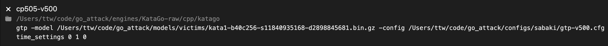

# How to set up sabaki

You can install Sabaki from https://sabaki.yichuanshen.de/.
If you are on MacOS, you can install using homebrew with the command
`brew install sabaki`.

## Bot setup
0. First build the C++ katago executable.
   To do this, 
   you'll want to run the following commands in both the
   `engines/KataGo-custom/cpp`
   and
   `engines/KataGo-raw/cpp`
   directories.
   ```
   cmake . -DUSE_BACKEND=OPENCL -DUSE_TCMALLOC=1
   make -j
   ```
   Adjust the backend and whether to use tcmalloc as needed.
1. Open up Sabaki preferences by pressing command comma (⌘,).
2. Go to the Engines tab.
3. A sample config would be the following:
  
  The first line is the bot name,
  the second line is the path to the executable,
  the third line are the flags passed to the executable,
  are initial commands passed to gtp
  (in this case giving the bot infinite time to make moves).

## List of bot configs

Adversary models can be downloaded from
https://drive.google.com/drive/folders/1-bGX-NQOh6MuRPoXJgYHb9-jWRJvviSg?usp=sharing.
Base KataGo models can be downloaded from
https://katagotraining.org/networks/.

```
adv505h-s219953408-v600-vm-cp505-v1
/Users/ttw/code/go_attack/engines/KataGo-custom/cpp/katago
gtp -model /Users/ttw/code/go_attack/models/adv/cp505h-adv219953408.bin.gz -victim-model /Users/ttw/code/go_attack/models/victims/kata1-b40c256-s11840935168-d2898845681.bin.gz -config /Users/ttw/code/go_attack/configs/sabaki/gtp-adv600-victim1.cfg
time_settings 0 1 0

adv505-s34090496-v600-vs-cp505-v1
/Users/ttw/code/go_attack/engines/KataGo-custom/cpp/katago
gtp -model /Users/ttw/code/go_attack/models/adv/cp505-adv34090496.bin.gz -victim-model /Users/ttw/code/go_attack/models/victims/kata1-b40c256-s11840935168-d2898845681.bin.gz -config /Users/ttw/code/go_attack/configs/sabaki/gtp-adv600-victim1.cfg
time_settings 0 1 0

adv505-s34090496-v600-vs-cp505-v1-norsym
/Users/ttw/code/go_attack/engines/KataGo-custom/cpp/katago
gtp -model /Users/ttw/code/go_attack/models/adv/cp505-adv34090496.bin.gz -victim-model /Users/ttw/code/go_attack/models/victims/kata1-b40c256-s11840935168-d2898845681.bin.gz -config /Users/ttw/code/go_attack/configs/sabaki/gtp-adv600-victim1-norsym.cfg 
time_settings 0 1 0

cp505-v500
/Users/ttw/code/go_attack/engines/KataGo-raw/cpp/katago
gtp -model /Users/ttw/code/go_attack/models/victims/kata1-b40c256-s11840935168-d2898845681.bin.gz -config /Users/ttw/code/go_attack/configs/sabaki/gtp-v500.cfg
time_settings 0 1 0

cp505-v1
/Users/ttw/code/go_attack/engines/KataGo-raw/cpp/katago
gtp -model /Users/ttw/code/go_attack/models/victims/kata1-b40c256-s11840935168-d2898845681.bin.gz -config /Users/ttw/code/go_attack/configs/sabaki/gtp-v1.cfg
time_settings 0 1 0

katago-cp127-v1
/Users/ttw/code/go_attack/engines/KataGo-raw/cpp/katago
gtp -model /Users/ttw/code/go_attack/models/victims/kata1-b20c256x2-s5303129600-d1228401921.bin.gz -config /Users/ttw/code/go_attack/configs/sabaki/gtp-v1.cfg
time_settings 0 1 0

katago-cp37-v1
/Users/ttw/code/go_attack/engines/KataGo-raw/cpp/katago
gtp -model /Users/ttw/code/go_attack/models/victims/kata1-b6c96-s41312768-d6061202.txt.gz -config /Users/ttw/code/go_attack/configs/sabaki/gtp-v1.cfg
time_settings 0 1 0
```
