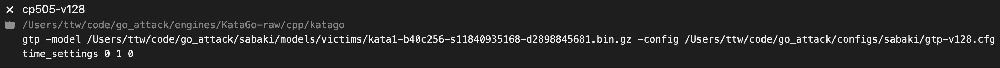

# How to run our adversary using Sabaki

## Sabaki setup
Sabaki is a cross-platform application for playing Go and editing SGF files.
You can install Sabaki from https://sabaki.yichuanshen.de/.
If you are on MacOS, you can install using Homebrew with the command
`brew install sabaki`.

## Download adversary and victim neural nets
Run `sabaki/scripts/download-models.sh`
to automatically download the original cyclic adversary and pass adversary.
Find other models on our [Google Drive](https://drive.google.com/drive/folders/1-bGX-NQOh6MuRPoXJgYHb9-jWRJvviSg?usp=sharing).

The base KataGo models are downloaded from https://katagotraining.org/networks/.

## Bot setup
0. First build the C++ KataGo executable.
   To do this, 
   you'll want to run the following commands in both the
   `engines/KataGo-custom/cpp`
   and
   `engines/KataGo-raw/cpp`
   directories.
   ```
   cmake . -DUSE_BACKEND=OPENCL -DUSE_TCMALLOC=1
   make -j
   ```
   Adjust the backend and whether to use tcmalloc as needed. See https://github.com/lightvector/KataGo/blob/master/Compiling.md for detailed compilation instructions.
1. Open up Sabaki preferences. On macOS, press command comma (⌘,), on Linux go to "File->Preferences", and on other platforms go to Preferences in the top-level drop-down menu. 
2. Go to the Engines tab. Then click the "Add" button on the bottom left to add a new config for our adversary.
3. A sample config would be the following:
  
  The first line is a name for our engine (this can be anything),
  the second line is the path to the executable,
  the third line is the flags passed to the executable,
  and the fourth line is the initial commands passed to gtp
  (in this case giving the bot infinite time to make moves).
  See below for more sample configs.
4. After adding a config, you can follow the instructions at https://youtu.be/6ZA_saVHyTA to play against the newly configured engine.

In particular, the following config runs our cyclic-adversary, assuming this
repo is checked out at `/Users/ttw/code/go_attack/engines/` (the paths will need
to be adjusted depending on where your copy of the repo is located):
```
cyclic-adv-s545m-v600-vm-cp505-v1-s
/Users/ttw/code/go_attack/engines/KataGo-custom/cpp/katago
gtp -model /Users/ttw/code/go_attack/sabaki/models/adv/cyclic/model.bin.gz -victim-model /Users/ttw/code/go_attack/sabaki/models/victims/kata1-b40c256-s11840935168-d2898845681.bin.gz -config /Users/ttw/code/go_attack/configs/sabaki/gtp-adv600-vm1-s.cfg
time_settings 0 1 0
```

## More sample bot configs
You'll need to change the paths to the models and executables for your machine.
```
# Pass-adversary
pass-adv-s34m-v600-vs-cp505-v1-s
/Users/ttw/code/go_attack/engines/KataGo-custom/cpp/katago
gtp -model /Users/ttw/code/go_attack/sabaki/models/adv/pass/model.bin.gz -victim-model /Users/ttw/code/go_attack/sabaki/models/victims/kata1-b40c256-s11840935168-d2898845681.bin.gz -config /Users/ttw/code/go_attack/configs/sabaki/gtp-adv600-vm1-s.cfg 
time_settings 0 1 0

# Latest with 128 visits
cp505-v128
/Users/ttw/code/go_attack/engines/KataGo-raw/cpp/katago
gtp -model /Users/ttw/code/go_attack/sabaki/models/victims/kata1-b40c256-s11840935168-d2898845681.bin.gz -config /Users/ttw/code/go_attack/configs/sabaki/gtp-v128.cfg
time_settings 0 1 0

# Latest with no search
cp505-v1
/Users/ttw/code/go_attack/engines/KataGo-raw/cpp/katago
gtp -model /Users/ttw/code/go_attack/sabaki/models/victims/kata1-b40c256-s11840935168-d2898845681.bin.gz -config /Users/ttw/code/go_attack/configs/sabaki/gtp-v1.cfg
time_settings 0 1 0
```

## Internal notes
The following config enables playing against an adversary (or victim) over SSH.
To do this on a machine M without `/nas/` access,
you need to clone the `go_attack` repo on M,
download the adversary and victim models on M,
and make sure Docker works on M.
```
# Cyclic-adversary over ssh
ssh-cyclic-adv-s545m-v600-vm-cp505-v1-s
ssh
rnn -tt 'bash -l -c "/nas/ucb/tony/go-attack/gtp-host/go_attack/sabaki/scripts/docker-katago.sh custom gtp -model /models/adv/cyclic/model.bin.gz -victim-model /models/victims/kata1-b40c256-s11840935168-d2898845681.bin.gz -config /go_attack/configs/sabaki/gtp-adv600-vm1-s.cfg -config /go_attack/configs/compute/1gpu.cfg"'
time_settings 0 1 0
```

See https://github.com/AlignmentResearch/KataGoVisualizer/blob/3216f9b5bebaf1377dc1e320294abcc0f65bd8bd/notebooks/notebooks/paper/estimate-flops-adv.ipynb for locations of adversaries on the `/nas/`.
